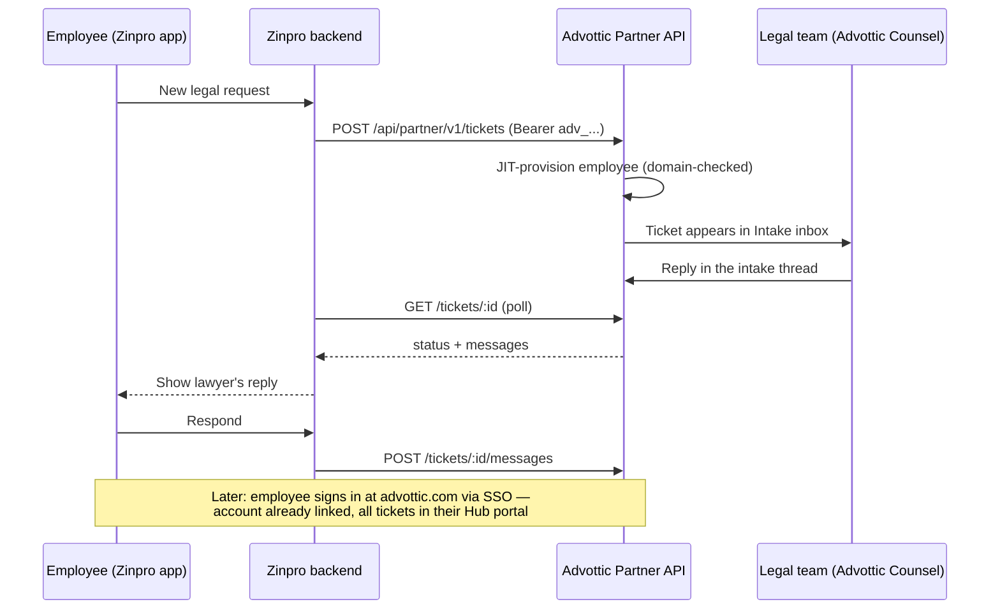

# Zinpro ↔ Advottic corporate legal integration

Hand this document to the Zinpro app team. It contains everything needed to
file and follow legal requests in Advottic on behalf of company employees.

## The model in one paragraph

The company holds a **firm/enterprise Advottic license**. The Zinpro app talks
to Advottic with one **firm-scoped API token**. When an employee files a legal
request in Zinpro, Advottic **provisions that employee automatically** (their
email domain must match the company's registered domains — that is the trust
anchor) and creates the ticket straight into the legal team's **Intake inbox**,
where lawyers triage, respond, request documents, run conflict checks, and
convert requests into full matters. Replies flow back over the same API so the
employee can read and answer **inside Zinpro**. When the employee later signs
in to Advottic itself — via **SSO/SAML with their work email** — their account
already exists and every ticket they ever filed from Zinpro is waiting in
their Hub portal, along with the full employee toolset (documents, templates,
signatures, secure sharing).



## One-time setup (Advottic side, done by the firm admin)

1. **Register the company email domains**: Counsel → Settings → Access →
   internal domains (e.g. `zinpro.com`). The Partner API refuses to provision
   any employee outside these domains.
2. **Mint the integration token**: Profile → API tokens → create a token with
   the **firm scope** and **write** scope. It looks like `adv_...` — shown
   once. Store it in the Zinpro backend's secret manager. (Rotate/revoke from
   the same screen at any time.)
3. **(Recommended) SSO**: connect the company IdP via SAML (Counsel →
   Settings → SSO & provisioning). Employees then sign in to advottic.com
   with their work email; SCIM user sync is also available (same page).

## API

Base URL: `https://advottic.com`
Auth header on every call: `Authorization: Bearer adv_<token>`
All responses are JSON. Errors: `{ "error": "..." }` with 4xx/5xx status.
Rate limits: 60 ticket creations / 240 messages per 5 minutes per firm.

### Create a ticket

`POST /api/partner/v1/tickets`

```json
{
  "employee": { "email": "jane@zinpro.com", "name": "Jane Doe", "department": "Sales" },
  "subject": "NDA needed for Acme pilot",
  "description": "We are starting a pilot with Acme Corp next month and need an NDA before sharing specs.",
  "category": "NDA review",
  "priority": "normal",
  "externalId": "ZIN-4821"
}
```

- `employee.email` (required) — must be on a registered company domain.
  First ticket from a new employee **creates their Advottic account record**.
- `externalId` (recommended) — your ticket id. Makes the call **idempotent**:
  retries return the existing ticket (HTTP 200) instead of duplicating (201).
- `priority`: `low | normal | high | urgent`.

Response `201` (or `200` on idempotent replay):

```json
{ "ticket": { "id": "…", "status": "in_progress", "subject": "…", "messages": [], "externalId": "ZIN-4821", "caseId": null, … } }
```

### List tickets

`GET /api/partner/v1/tickets?employeeEmail=jane@zinpro.com&limit=50`
Omit `employeeEmail` for all partner-filed tickets in the firm (newest first).

### Read one ticket (poll for updates)

`GET /api/partner/v1/tickets/{id}` → `{ "ticket": { …, "status", "messages": [ { "id", "author", "role": "employee"|"legal", "at", "text" } ] } }`

- `status` walks the legal pipeline: `in_progress → conflict_check_passed/⚑ →
  engaged → converted` (converted = promoted to a full matter; `caseId` set)
  or `rejected`.
- Poll every 60–120 s for open tickets, or on app-open/pull-to-refresh.
  (Webhooks are on the roadmap; polling is the supported v1 mechanism.)

### Employee replies

`POST /api/partner/v1/tickets/{id}/messages`

```json
{ "employeeEmail": "jane@zinpro.com", "text": "Attached the draft to my request — can we get this signed by Friday?" }
```

The message lands in the same thread the lawyer sees in the Intake inbox.
`employeeEmail` must match the ticket's employee (403 otherwise).

## Reference client (Node/TypeScript)

```ts
const BASE = 'https://advottic.com';
const TOKEN = process.env.ADVOTTIC_PARTNER_TOKEN!; // adv_...

async function api(path: string, init?: RequestInit) {
  const res = await fetch(`${BASE}${path}`, {
    ...init,
    headers: {
      Authorization: `Bearer ${TOKEN}`,
      'Content-Type': 'application/json',
      ...init?.headers,
    },
  });
  const body = await res.json();
  if (!res.ok) throw new Error(`${res.status}: ${body.error}`);
  return body;
}

export const advottic = {
  createTicket: (t: {
    employee: { email: string; name?: string; department?: string };
    subject: string; description: string;
    category?: string; priority?: 'low'|'normal'|'high'|'urgent'; externalId?: string;
  }) => api('/api/partner/v1/tickets', { method: 'POST', body: JSON.stringify(t) }),

  listTickets: (employeeEmail?: string) =>
    api(`/api/partner/v1/tickets${employeeEmail ? `?employeeEmail=${encodeURIComponent(employeeEmail)}` : ''}`),

  getTicket: (id: string) => api(`/api/partner/v1/tickets/${id}`),

  reply: (id: string, employeeEmail: string, text: string) =>
    api(`/api/partner/v1/tickets/${id}/messages`, {
      method: 'POST',
      body: JSON.stringify({ employeeEmail, text }),
    }),
};
```

Smoke test with curl:

```bash
curl -s -X POST https://advottic.com/api/partner/v1/tickets \
  -H "Authorization: Bearer $ADVOTTIC_PARTNER_TOKEN" -H "Content-Type: application/json" \
  -d '{"employee":{"email":"jane@zinpro.com","name":"Jane Doe"},"subject":"Test ticket","description":"Integration smoke test.","externalId":"ZIN-TEST-1"}'
```

## What each side sees

- **Legal team (Advottic Counsel)**: partner tickets are ordinary intake
  requests — kanban triage, priority, conflict check, document requests and
  uploads, thread replies, meeting scheduling, convert-to-case. Nothing new to
  learn.
- **Employee (Zinpro app)**: create → track status → read/answer the lawyer's
  messages. Zinpro is the quick companion.
- **Employee (advottic.com, SSO)**: full Hub portal — every ticket (including
  Zinpro-filed ones, auto-claimed on first sign-in), document library,
  templates/forms, signature requests, secure sharing. Zinpro never blocks the
  full experience; it accelerates it.

## Security model (for the Zinpro team's review)

- One bearer token per firm, SHA-256-stored, revocable, scope-checked
  (`write`) on every call; all data access is confined to that firm.
- JIT provisioning is **domain-gated**: only emails on the firm's registered
  internal domains (public webmail is rejected), and deactivated employees are
  refused.
- Idempotency by `externalId` prevents duplicate tickets on retries.
- Per-firm rate limiting backs every write.
- No document bytes flow through the partner API in v1 — attachments are
  exchanged in Advottic itself (roadmap: pre-signed upload URLs).
