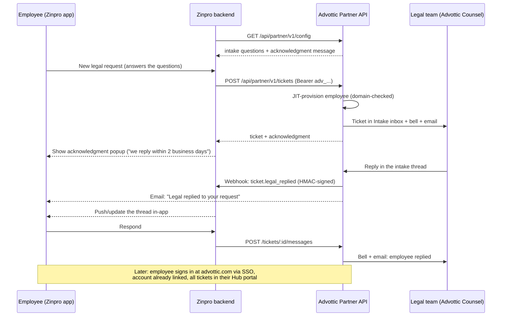

# Zinpro ↔ Advottic corporate legal integration

**Hand this document to the Zinpro app team.** It is self-contained: everything
needed to file and follow legal requests in Advottic on behalf of company
employees. That covers the API, the event webhooks, the screens the app
should present, and what the legal team controls from their side.

---

## 1. The model in one paragraph

The company holds a **firm/enterprise Advottic license**. The Zinpro app talks
to Advottic with one **firm-scoped API token**. When an employee files a legal
request in Zinpro, Advottic **provisions that employee automatically** (their
email domain must match the company's registered domains, which is the trust
anchor) and creates the ticket straight into the legal team's **Intake inbox**,
where lawyers triage, respond, request documents, run conflict checks, and
convert requests into full matters. The legal team is **notified instantly**
(in-app bell + email) when a ticket or reply arrives. Replies flow back over
the same API and over a **signed webhook**, so Zinpro can update its UI and
push-notify the employee without polling. When the employee later signs in to
Advottic itself (via **SSO/SAML with their work email**), their account
already exists and every ticket they ever filed from Zinpro is waiting in
their Hub portal, along with the full employee toolset (documents, templates,
signatures, secure sharing, @-mentions, chat).



---

## 2. What the integration includes

| Capability | How it works |
|---|---|
| File a legal request from Zinpro | `POST /tickets`: JIT-provisions the employee, lands in the legal Intake inbox |
| **Legal-team-configured intake questions** | Legal defines them in Advottic; Zinpro fetches them from `GET /config` and renders them on the request form |
| **Acknowledgment popup** | Legal writes the message (usually their response-time promise); returned on every ticket create; show it to the employee immediately |
| Two-way conversation | Employee replies via API; legal replies appear in `GET /tickets/:id` and arrive via webhook |
| **Instant legal-team notification** | Every new ticket and employee reply rings the legal team's in-app bell **and** emails the firm's owners/admins |
| **Employee email notifications** | Advottic emails the employee directly when legal replies, and when the request is converted to a matter or closed, even if they never reopen the app |
| **Outbound webhooks** | HMAC-SHA256-signed POSTs to the Zinpro backend on legal replies and status changes, to drive real-time UI updates and your own push notifications |
| **Stale-request reminders** | If a ticket sits unanswered past the window legal configured, the legal team is automatically nudged (bell + email); repeats at most once per window |
| Status pipeline | `in_progress → conflict_check_passed/flagged → engaged → converted` (or `rejected`), all visible via API and webhook |
| Full experience on the web | On first SSO sign-in the employee's Zinpro-filed tickets are already in their Advottic Hub portal, with @-mentions, document library, forms, signatures, secure sharing |

> Note on @-mentions and chat: inside Advottic, intake threads and firm chat
> support @-mentions with notifications and email. Over the partner API,
> messages are plain text. Employees get the full mention/chat experience
> when they sign in at advottic.com; Zinpro is the quick companion.

---

## 3. One-time setup (Advottic side, done by the firm admin)

1. **Register the company email domains**: Counsel → Settings → Access →
   internal domains (e.g. `zinpro.com`). The Partner API refuses to provision
   any employee outside these domains.
2. **Mint the integration token**: Profile → API tokens → create a token with
   the **firm scope** and **write** scope. It looks like `adv_...` and is
   shown once. Store it in the Zinpro backend's secret manager. (Rotate/revoke from
   the same screen at any time.)
3. **Configure the partner panel**: Counsel → Settings → **Partner app
   integration**:
   - **Confirmation message after filing**: the popup text the employee sees
     the moment their request is filed. Most teams state their response time,
     e.g. *"Thanks, your request has reached the legal team. We usually
     respond within 2 business days; urgent matters are triaged first."*
   - **Intake questions**: up to 12 questions (free text, choice list, or
     yes/no; each optionally required) that the Zinpro form must ask. Answers
     show on the request in the Intake inbox.
   - **Event webhook**: paste the Zinpro backend's https endpoint; Advottic
     mints a signing secret (`whsec_...`) you can reveal and rotate here. Give
     both the URL and the secret to the Zinpro team.
   - **Reminder window**: hours before an unanswered request nudges the
     team again (default 24; 0 turns reminders off).
4. **(Recommended) SSO**: connect the company IdP via SAML (Counsel →
   Settings → SSO & provisioning). Employees then sign in to advottic.com
   with their work email; SCIM user sync is also available (same page).

---

## 4. How the Zinpro app should lay out the experience

Four surfaces. Each maps to exactly one API call (plus the webhook feed).

### 4.1 "New legal request" screen

- On screen load (or app start, cached), call `GET /config`. Render, in
  order:
  1. **Subject** (single line) and **Description** (multi-line), always.
  2. **Category** (optional single line or your own picker) and **Priority**
     (`low / normal / high / urgent`, default `normal`).
  3. **The firm's configured questions**, in the order returned. Render by
     `type`:
     - `text` → single/multi-line text input,
     - `select` → dropdown/segmented control with exactly the given
       `options`,
     - `yesno` → toggle or two buttons (send the answer as `"Yes"`/`"No"`).
     Mark `required: true` questions with an asterisk and block submit until
     they are answered. The API also rejects a missing required answer with
     a 400 naming the question.
- On submit, `POST /tickets` with the fields plus
  `answers: { [question.id]: value }` and your own `externalId`.

### 4.2 The acknowledgment popup (after filing)

Every successful create (201, and idempotent 200 replays) returns an
`acknowledgment` string, **the message the legal team wrote, usually their
response-time promise**. Show it in a confirmation dialog/toast immediately:

```
┌─────────────────────────────────────────────┐
│  ✓  Request filed                           │
│                                             │
│  Thanks, your request has reached the       │
│  legal team. We usually respond within      │
│  2 business days; urgent matters are        │
│  triaged first.                             │
│                                             │
│                 [ View my requests ]  [ OK ] │
└─────────────────────────────────────────────┘
```

Don't hard-code the text; legal edits it in Advottic and expects the app to
show the current version. Fall back to a generic "Request filed" if the field
is ever empty.

### 4.3 Ticket list screen

`GET /tickets?employeeEmail=...` (newest first). Suggested status badges:

| API `status` | Show the employee | Tone |
|---|---|---|
| `in_progress` | "With legal" | neutral |
| `conflict_check_passed` | "In review" | neutral |
| `conflict_check_flagged` | "In review" | neutral (internal legal step, don't alarm the employee) |
| `engaged` | "In progress" | positive |
| `converted` | "Matter opened" | positive |
| `rejected` | "Closed" | muted |

Unread indicator: mark a ticket unread when a `ticket.legal_replied` webhook
arrives (or when polling shows a new message with `role: "legal"`).

### 4.4 Ticket detail / conversation screen

`GET /tickets/:id`. Render `messages[]` as a chat thread:

- `role: "employee"` → the requester's side.
- `role: "legal"` → the other side, labeled with `author` (the lawyer's name).
- A reply box at the bottom → `POST /tickets/:id/messages`.

**`messages[]` contains only what the requester is allowed to see.** The legal
team can write internal notes on a request that are visible to firm staff
alone; those are filtered out of this endpoint and out of every webhook
payload, so nothing you render from the API can leak them. You do not need to
filter anything yourself. The same applies to the system's own activity
entries (assignments, status changes). They are omitted here, so the array
is purely human messages.

Advottic's own conversation surface additionally carries file attachments and
"send us this document" links. Those are exchanged inside Advottic rather than
over the partner API in v1 (see §7), so a thread may reference a document that
does not appear in `messages[]`. Deep-link the employee to their Hub portal
when they need it.
- Show the status badge (table above) as a banner at the top; when `caseId`
  becomes non-null, show "The legal team opened a matter from this request."

### 4.5 Keeping it live

Two complementary channels. Use both:

- **Webhooks (preferred)**: Advottic POSTs to your backend on every legal
  reply and status change (§6). Relay to the app via your own push channel.
- **Polling (fallback / belt-and-braces)**: `GET /tickets/:id` every 60–120 s
  while a ticket screen is open, and on app-open / pull-to-refresh.

Advottic also emails the employee directly on legal replies and terminal
status changes, so nothing is lost if the app is uninstalled.

---

## 5. API reference

Base URL: `https://advottic.com`
Auth header on every call: `Authorization: Bearer adv_<token>`
All responses are JSON. Errors: `{ "error": "..." }` with 4xx/5xx status.
Rate limits: 60 ticket creations / 240 messages per 5 minutes per firm.

### 5.1 Get the firm's configuration

`GET /api/partner/v1/config`

```json
{
  "firmName": "Zinpro Legal",
  "acknowledgment": "Thanks, your request has reached the legal team. We usually respond within 2 business days; urgent matters are triaged first.",
  "questions": [
    { "id": "q-bu", "label": "Which business unit is this for?", "type": "select", "options": ["Sales", "R&D", "Operations", "Other"], "required": true },
    { "id": "q-deadline", "label": "Is there a hard deadline?", "type": "text", "options": null, "required": false },
    { "id": "q-signed", "label": "Has anything already been signed?", "type": "yesno", "options": null, "required": true }
  ],
  "webhook": { "configured": true }
}
```

Fetch on app start and cache; refresh at least daily; the legal team can
change questions and the acknowledgment at any time.

#### Per-request-type forms (optional, additive)

The legal team can now build a **form per request type** in Advottic, rather
than one list of questions for the whole company. To pick those up, pass the
request type as `?type=<slug>` (the same string you already send as
`category` on ticket create, e.g. `?type=nda`):

`GET /api/partner/v1/config?type=nda`

The response shape is unchanged. Two things differ:

- `questions` is the built form, flattened into the same three types you
  already render (`text`, `select`, `yesno`). Conditional questions are
  included unconditionally and come back `required: false`, because the app
  cannot evaluate the condition; whether they are genuinely required is
  worked out on our side from the answers you send.
- `formVersionId` is a string naming the exact version those questions came
  from. **Echo it back on ticket create.** Without the parameter, or where the
  legal team has published nothing for that type, `questions` is exactly what
  it has always been and `formVersionId` is `null`.

`formVersionId` is also present (as `null`) on the plain `GET /config`, so
adding the field breaks no existing parser.

**Size the form UI for a larger list.** The firm-wide question list is capped
at 12 questions with at most 12 options each. A built form is not: it can carry
up to 60 questions, and a choice list up to 100 options. The projected list is
deliberately not truncated to the old bounds, because a dropped question can be
the one that controls whether a later question applies, and a dropped option
would make a legitimate choice unsubmittable. Render the list at whatever
length it arrives.

**A `formVersionId` that does not match is a 400.** If you send one and it is
not the version currently published for that request type (the form was
rebuilt, or `category` is not the request type's slug), the create is refused
with a message naming the fetch that fixes it, rather than filing a request
whose answers match no question we hold. Omit the field and nothing changes.

### 5.2 Create a ticket

`POST /api/partner/v1/tickets`

```json
{
  "employee": { "email": "jane@zinpro.com", "name": "Jane Doe", "department": "Sales" },
  "subject": "NDA needed for Acme pilot",
  "description": "We are starting a pilot with Acme Corp next month and need an NDA before sharing specs.",
  "category": "NDA review",
  "priority": "normal",
  "externalId": "ZIN-4821",
  "answers": { "q-bu": "Sales", "q-deadline": "Before March 1", "q-signed": "No" }
}
```

- `employee.email` (required): must be on a registered company domain.
  First ticket from a new employee **creates their Advottic account record**.
- `externalId` (recommended): your ticket id. Makes the call **idempotent**:
  retries return the existing ticket (HTTP 200) instead of duplicating (201).
- `priority`: `low | normal | high | urgent`.
- `answers`: keyed by the `id`s from `GET /config`. Unknown ids are ignored;
  a missing **required** answer is a 400 naming the question; a `select`
  answer must be one of the listed options.
- `formVersionId` (optional): the value `GET /config?type=<slug>` returned
  next to the questions these answers were collected on. Send it whenever you
  have one. It is what records which version of the form the request was
  filed against, and what tells us the answers are keyed to the questions
  currently published rather than to a cached older set.

##### When a built form applies

A built form is only used to check a ticket when the ticket shows it was
collected on that form: it echoes the currently published `formVersionId`, or
at least one answer is keyed to one of the form's question ids. Until the app
sends one of those, tickets are checked exactly as they are today, against the
firm-wide question list. Nothing you do today starts failing.

Once a form does apply, two extra classes of 400 are possible, both naming the
question by its label and its `id`:

- **A value the question does not allow.** The three types this API carries
  cannot express everything the legal team can set: a money field's two
  decimal places, a number's or a date's range, a maximum length, an email or
  phone shape. Those are checked when the ticket arrives instead. The message
  says what to change, for example: `Answer for "Contract value" (question id
  amount) is not valid: Use two decimal places or fewer, for example 2500.00.`
  Surface it to the employee; it is written for them to act on.
- **A conditional question that their answers made applicable.** Conditional
  questions arrive `required: false` so the app never blocks anyone on a
  question that may not apply. Whether one actually applies depends on the
  other answers, which only we can evaluate, so a genuinely required one comes
  back as a 400 naming it. The question is always on the form already, so the
  employee can fill it in and resubmit.

Only the first problem is spelled out, with a count of any others, matching how
a missing required answer has always been reported. `category` must be the
request type's slug for any of this to engage; a slug we do not recognise falls
back to the firm-wide questions.

Response `201` (or `200` on idempotent replay):

```json
{
  "ticket": { "id": "…", "status": "in_progress", "subject": "…", "messages": [], "externalId": "ZIN-4821", "caseId": null },
  "acknowledgment": "Thanks, your request has reached the legal team. We usually respond within 2 business days; urgent matters are triaged first."
}
```

Show `acknowledgment` to the employee immediately (§4.2). Creating a ticket
also rings the legal team's bell and emails the firm's owners/admins; no
action needed on your side.

### 5.3 List tickets

`GET /api/partner/v1/tickets?employeeEmail=jane@zinpro.com&limit=50`
Omit `employeeEmail` for all partner-filed tickets in the firm (newest first).

### 5.4 Read one ticket (poll for updates)

`GET /api/partner/v1/tickets/{id}` → `{ "ticket": { …, "status", "messages": [ { "id", "author", "role": "employee"|"legal", "at", "text" } ] } }`

- `status` walks the legal pipeline: `in_progress → conflict_check_passed/⚑ →
  engaged → converted` (converted = promoted to a full matter; `caseId` set)
  or `rejected`.

### 5.5 Employee replies

`POST /api/partner/v1/tickets/{id}/messages`

```json
{ "employeeEmail": "jane@zinpro.com", "text": "Attached the draft to my request. Can we get this signed by Friday?" }
```

The message lands in the same thread the lawyer sees in the Intake inbox and
notifies the legal team (bell + email). `employeeEmail` must match the
ticket's employee (403 otherwise).

---

## 6. Webhooks (Advottic → Zinpro backend)

Configured by the firm admin in Counsel → Settings → Partner app integration
(URL + signing secret). Advottic POSTs JSON to that URL on:

| Event | Fired when | Suggested app behavior |
|---|---|---|
| `ticket.legal_replied` | A lawyer replies in the thread | Push-notify the employee; refresh the thread; mark unread |
| `ticket.status_changed` | Conflict check ran / cleared, matter converted, or request closed | Update the status badge; on `converted`, show the "matter opened" banner |

### 6.1 Request format

```
POST <your webhook URL>
Content-Type: application/json
X-Advottic-Event: ticket.legal_replied
X-Advottic-Timestamp: 1753500000
X-Advottic-Signature: 3f1a…e9   (hex HMAC-SHA256)
```

```json
{
  "event": "ticket.legal_replied",
  "at": "2026-07-25T18:30:00.000Z",
  "ticket": {
    "id": "5c9e…",
    "externalId": "ZIN-4821",
    "employeeEmail": "jane@zinpro.com",
    "subject": "NDA needed for Acme pilot",
    "status": "in_progress",
    "caseId": null
  },
  "message": {
    "id": "…",
    "author": "Sam Attorney",
    "role": "legal",
    "at": "2026-07-25T18:30:00.000Z",
    "text": "Reviewed. Two changes needed before signature. See my notes."
  }
}
```

(`message` is present only on `ticket.legal_replied`.)

### 6.2 Verifying the signature (required)

The signature is `HMAC-SHA256(secret, "<timestamp>.<raw body>")`, hex-encoded.
Reject requests whose signature doesn't match or whose timestamp is older
than ~5 minutes (replay window):

```ts
import crypto from 'crypto';

function verifyAdvotticWebhook(req: { headers: Record<string, string>; rawBody: string }, secret: string): boolean {
  const ts = req.headers['x-advottic-timestamp'];
  const sig = req.headers['x-advottic-signature'];
  if (!ts || !sig) return false;
  if (Math.abs(Date.now() / 1000 - Number(ts)) > 300) return false; // 5 min replay window
  const expected = crypto.createHmac('sha256', secret).update(`${ts}.${req.rawBody}`).digest('hex');
  return crypto.timingSafeEqual(Buffer.from(expected), Buffer.from(sig));
}
```

Compute the HMAC over the **raw** request body (before any JSON parsing /
re-serialization).

### 6.3 Delivery semantics

Delivery is **at-most-once, best-effort** (10-second timeout, no automatic
retries in v1). Respond `200` quickly and process async. Keep the 60–120 s
polling as the safety net; the polled `GET /tickets/{id}` is always the
source of truth. The signing secret can be rotated in the Advottic settings
panel at any time; coordinate rotation with the firm admin.

---

## 7. Who gets notified of what (the full matrix)

| Trigger | Legal team | Employee | Zinpro backend |
|---|---|---|---|
| Ticket created from Zinpro | Bell + email (owners/admins) | Acknowledgment popup (API response) | None (it made the call) |
| Employee replies from Zinpro | Bell + email | None | None (it made the call) |
| Legal replies | None | **Email** ("Legal replied…", link to portal) | **Webhook** `ticket.legal_replied` |
| Conflict check runs / clears | (visible in Counsel) | None | **Webhook** `ticket.status_changed` |
| Request converted to a matter | None | **Email** ("Your request became a matter") | **Webhook** `ticket.status_changed` |
| Request closed/rejected | None | **Email** (neutral wording) | **Webhook** `ticket.status_changed` |
| No legal reply past the reminder window | **Bell + email nudge** (hourly cron, at most once per window) | None | None |
| @-mention inside Advottic (web) | Bell (+ email for chat mentions) | Bell when mentioned (after SSO sign-in) | None |

All notifications are best-effort and never block the underlying write; email
requires the firm's email provider to be configured (it is, for Zinpro).

---

## 8. Reference client (Node/TypeScript)

```ts
const BASE = 'https://advottic.com';
const TOKEN = process.env.ADVOTTIC_PARTNER_TOKEN!; // adv_...

async function api(path: string, init?: RequestInit) {
  const res = await fetch(`${BASE}${path}`, {
    ...init,
    headers: {
      Authorization: `Bearer ${TOKEN}`,
      'Content-Type': 'application/json',
      ...init?.headers,
    },
  });
  const body = await res.json();
  if (!res.ok) throw new Error(`${res.status}: ${body.error}`);
  return body;
}

export const advottic = {
  /** Firm config: intake questions + acknowledgment message. Cache ~1 day.
   *  Pass the request type slug to get that type's built form, if any, plus
   *  the `formVersionId` to echo back on create. */
  getConfig: (type?: string) =>
    api(`/api/partner/v1/config${type ? `?type=${encodeURIComponent(type)}` : ''}`),

  createTicket: (t: {
    employee: { email: string; name?: string; department?: string };
    subject: string; description: string;
    category?: string; priority?: 'low'|'normal'|'high'|'urgent'; externalId?: string;
    answers?: Record<string, string>; formVersionId?: string;
  }) => api('/api/partner/v1/tickets', { method: 'POST', body: JSON.stringify(t) }),
  // → { ticket, acknowledgment }. Show `acknowledgment` to the employee.

  listTickets: (employeeEmail?: string) =>
    api(`/api/partner/v1/tickets${employeeEmail ? `?employeeEmail=${encodeURIComponent(employeeEmail)}` : ''}`),

  getTicket: (id: string) => api(`/api/partner/v1/tickets/${id}`),

  reply: (id: string, employeeEmail: string, text: string) =>
    api(`/api/partner/v1/tickets/${id}/messages`, {
      method: 'POST',
      body: JSON.stringify({ employeeEmail, text }),
    }),
};
```

Smoke test with curl:

```bash
curl -s -X POST https://advottic.com/api/partner/v1/tickets \
  -H "Authorization: Bearer $ADVOTTIC_PARTNER_TOKEN" -H "Content-Type: application/json" \
  -d '{"employee":{"email":"jane@zinpro.com","name":"Jane Doe"},"subject":"Test ticket","description":"Integration smoke test.","externalId":"ZIN-TEST-1"}'
```

```bash
curl -s https://advottic.com/api/partner/v1/config \
  -H "Authorization: Bearer $ADVOTTIC_PARTNER_TOKEN"
```

---

## 9. What each side sees

- **Legal team (Advottic Counsel)**: partner tickets are ordinary intake
  requests: kanban triage, priority, the employee's question answers,
  conflict check, document requests and uploads, thread replies with
  @-mentions, meeting scheduling, convert-to-case. New tickets and replies
  ring their bell and email the admins; stale ones nudge automatically.
- **Employee (Zinpro app)**: answer the firm's questions → file → see the
  legal team's acknowledgment → track status → read/answer the lawyer's
  messages, kept fresh by webhook-driven updates. Zinpro is the quick
  companion.
- **Employee (advottic.com, SSO)**: full Hub portal: every ticket (including
  Zinpro-filed ones, auto-claimed on first sign-in), the conversation with
  @-mentions and bell notifications, document library, templates/forms,
  signature requests, secure sharing. Zinpro never blocks the full
  experience; it accelerates it.

---

## 10. Security model (for the Zinpro team's review)

- One bearer token per firm, SHA-256-stored, revocable, scope-checked
  (`write`) on every call; all data access is confined to that firm.
- JIT provisioning is **domain-gated**: only emails on the firm's registered
  internal domains (public webmail is rejected), and deactivated employees are
  refused.
- Idempotency by `externalId` prevents duplicate tickets on retries.
- Per-firm rate limiting backs every write.
- Outbound webhooks are **HMAC-SHA256 signed** with a rotatable secret and a
  timestamp; verify both (§6.2) and use an https endpoint only.
- Question answers are validated server-side against the firm's configured
  question set (unknown ids dropped, select options enforced), so a stale or
  modified client can't inject arbitrary labeled data into legal's inbox.
- No document bytes flow through the partner API in v1; attachments are
  exchanged in Advottic itself (roadmap: pre-signed upload URLs).

---

## 11. Go-live checklist

**Firm admin (in Advottic)**
- [ ] Internal domains registered (Settings → Access)
- [ ] Partner token minted and handed to Zinpro via a secret channel
- [ ] Settings → Partner app integration: acknowledgment message written,
      intake questions configured, webhook URL + secret set, reminder window
      chosen
- [ ] (Recommended) SSO connected

**Zinpro team**
- [ ] Token stored in secret manager; never in the mobile app binary
- [ ] `GET /config` wired; questions rendered; required-marking enforced
- [ ] Acknowledgment popup shown from the API response (not hard-coded)
- [ ] Webhook endpoint live; signature + timestamp verified; 200-fast
- [ ] Polling fallback in place (60–120 s on open ticket screens)
- [ ] `externalId` set on every create; retries rely on idempotency
- [ ] Smoke test: file → see it in the legal Intake inbox → legal replies →
      webhook received → employee email received → status badge updates
